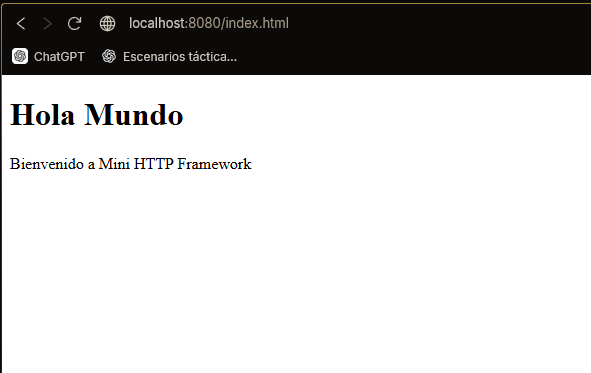
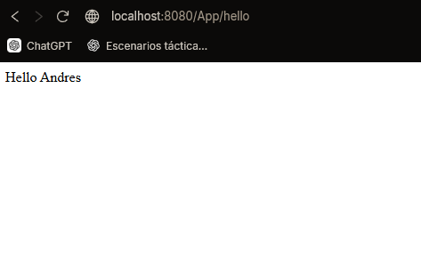
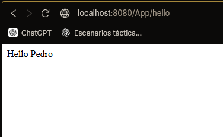
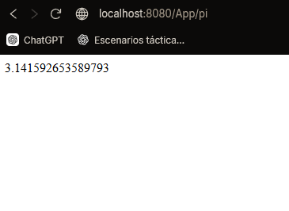

# LAB_TDSE_WEB_FRAMEWORK
# Mini HTTP Framework — Java

A lightweight HTTP server framework built from scratch in Java, inspired by microframeworks like Spark. It allows developers to define REST endpoints using lambda functions and serve static files with minimal configuration.

---

## Features

- Define REST routes with lambda functions via `Router.get()`
- Extract query parameters from requests via `req.getValues()`
- Serve static files (HTML, CSS, JS, images) from a configurable folder via `Router.staticfiles()`
- Automatic content-type detection for common file types
- Persistent server loop — handles multiple requests sequentially

---

## Project Architecture

```
src/
└── main/
    ├── java/
    │   └── project/tdse/lab/
    │       ├── client/
    │       │   └── EchoClient.java       
    │       ├── server/
    │       │   ├── EchoServer.java       
    │       │   ├── HttpServer.java       
    │       │   └── Router.java           
    │       ├── service/
    │       │   └── MathServices.java     
    │       └── util/
    │           ├── Request.java          
    │           ├── Response.java         
    │           ├── WebMethod.java        
    │           ├── URLParser.java        
    │           └── URLReader.java        
    
```

### Component Responsibilities

| Component | Responsibility |
|---|---|
| `HttpServer` | Accepts TCP connections, parses HTTP requests, dispatches to `Router` or serves static files |
| `Router` | Stores registered routes and static folder config; resolves incoming paths |
| `Request` | Wraps parsed path, method, and query parameters |
| `Response` | Holds status code and content-type for the response |
| `WebMethod` | `@FunctionalInterface` — enables lambda-based route handlers |
| `MathServices` | Entry point: registers routes and launches the server |

### Request Flow

```
Browser Request
      │
      ▼
 HttpServer (parses HTTP request line)
      │
      ├── Route registered? ──YES──► Router.handle() ──► WebMethod lambda ──► HTML response
      │
      └── NO ──► serveStaticFile() ──► reads file from target/classes/webroot/public/
```

---

## How to Run

### Prerequisites

- Java 11+
- Maven 3.x

### 1. Clone the repository

```bash
git clone <repository-url>
cd <project-folder>
```

### 2. Build the project

```bash
mvn clean install
```

This compiles the code and copies resources (including static files) to `target/classes/`.

### 3. Start the server

Run the `MathServices` main class:

```bash
mvn exec:java -Dexec.mainClass="project.tdse.lab.service.MathServices"
```

Or run it directly from your IDE by executing `MathServices.main()`.

The server will start on **port 35000**.

---

## Usage Examples

### Registered REST Routes

| URL | Response |
|---|---|
| `http://localhost:35000/pi` | `PI = 3.141592653589793` |
| `http://localhost:35000/hello?name=Juan` | `Hello Juan` |
| `http://localhost:35000/hello` | `Hello ` |

### Defining New Routes

In `MathServices.java`:

```java
Router.get("/greet", (req, res) -> "Good morning, " + req.getValues("name"));
Router.get("/sqrt",  (req, res) -> {
    String val = req.getQueryParam("val");
    return "sqrt = " + Math.sqrt(Double.parseDouble(val));
});
```

### Serving Static Files

Place files inside `src/main/resources/webroot/public/` and configure the folder:

```java
Router.staticfiles("webroot/public");
```

After building, files will be accessible at:

- `http://localhost:35000/` → serves `index.html`
- `http://localhost:35000/style.css`
- `http://localhost:35000/app.js`

---

## Supported Content Types

| Extension | Content-Type |
|---|---|
| `.html` | `text/html` |
| `.css` | `text/css` |
| `.js` | `application/javascript` |
| `.json` | `application/json` |
| `.png` | `image/png` |
| `.jpg` / `.jpeg` | `image/jpeg` |
| other | `text/plain` |

## Tests

Link: http://localhost:8080/index.html



Link: http://localhost:8080/App/hello?name=Andres



Link: http://localhost:8080/App/hello?name=Pedro



Link: http://localhost:8080/App/pi

